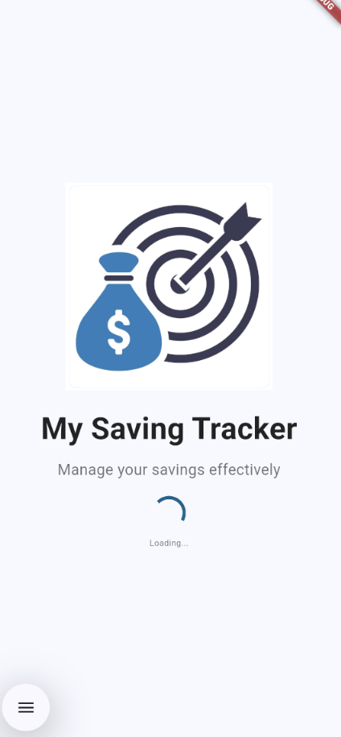
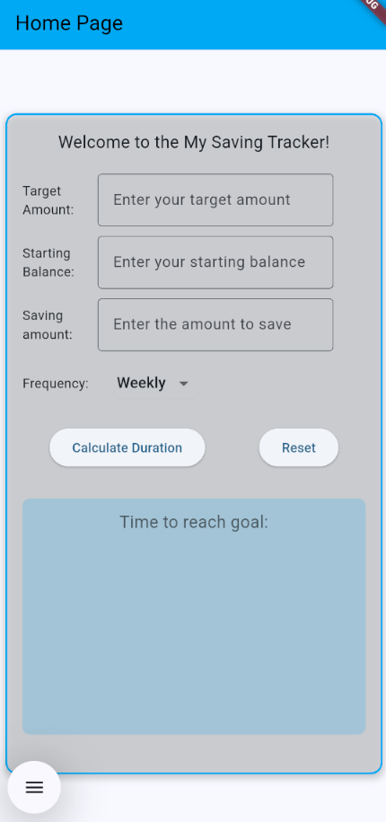
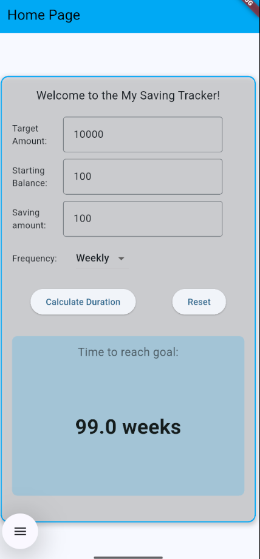

# My Saving Tracker

A utility app built with Flutter to calculate the time required to reach a savings goal. This project was developed for a lab assignment to demonstrate a solid understanding of fundamental Flutter concepts.

The application allows users to input a target savings amount, their starting balance and a recurring saving amount. Users can specify whether they are saving weekly or monthly. The app then calculates and clearly displays the total time needed to achieve the financial goal.

## Inputs → Process → Output

- **Input**  
  - Target Amount: The total amount of money user wants to save.
  - Starting Balance: The amount of money user has already saved.
  - Saving Amount: The amount user will save per period
  - Frequency: The saving period, either 'Weekly' or 'Monthly'.
- **Process**: The app calculates the number of periods needed using the formula
  - 'Periods = (Target Amount – Starting Balance) / Saving Amount'
- **Output**: The app displays the total number of weeks or months required to reach the goal by rounded to one decimal place.

## Widget List used

- Scaffold: Provides the basic layout structure for both the splash screen and home page.
- AppBar: Displays the title of the app at the top of the home page
- Column: Used to arrange widgets vertically
- Row: Used to arrange widgets horizontally.
- Container: Used to create the decorative boxes for the input form and the result display, adding padding, borders and shadows.
- Text: Displays all static text, labels and the final calculated result.
- TextField: Used to get the numeric inputs from the user
- DropdownButton: Allows the user to select the saving frequency ('Weekly' or 'Monthly').
- ElevatedButton: Used for the "Calculate Duration" and "Reset" buttons, allowing the user to perform actions.
- SizedBox: Used to add spacing and gaps between widgets for a cleaner layout.

## Basic Validation Approach

The app handles invalid inputs gracefully by performing checks before any calculation:

- It verifies that the Saving Amount is a positive number (greater than zero).
- It verifies that the Target Amount is also a positive number.
- It checks that the Target Amount is greater than the Starting Balance (to ensure there is a goal to save for).

If any of these checks fail, the calculation is stopped, and a user-friendly error message is displayed in the result area.

## Authorship Note with signature

  
  _________________________________
         (NAME and MATRIC)
“I confirm that this project represents my own original work in accordance with academic integrity policies. No part of the code was fully generated by AI tools such as ChatGPT or GitHub Copilot. I relied solely on lecture notes, class tutorials, and official Flutter documentation. I understand that my work may be scrutinized, and if it is found that I did not personally develop the code, marks may be deducted, or the submission may be disqualified.”

## Screenshots

- Splash page

- Home page before calculating

- Home page after calculating

